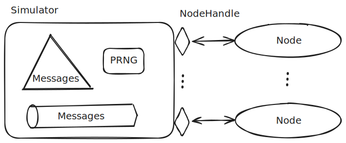

# The main test loop of simulation testing

In the last post we sketched a high-level plan of how to implement
language agnostic simulation testing.

In this post we'll start working on the implementation. In particular
we'll have a look at the simulator is implemented and how it's used to
in the main test loop that gives us simulation testing.

We'll be using Haskell as our implementation language, however fear not,
I'm aware it's not everybody's favorite language and I try to avoid any
clever uses in order to be accessible to the larger programming
community. Should anything be unclear, feel free to get in touch and
I'll do my best to explain it in a different way.

## High-level overview of how the simulator works

Before we start introducing code, let's try to visualise the end result:



The simulator consists of four things:

1.  A heap (or priority queue) of messages sorted by arrival time (the
    triangle in the picture);
2.  A pseudo-random number generator (PRNG);
3.  A variable number of "node handles" which connect the simulator to
    the SUT (nodes);
4.  A trace of client request and response messages to and from the
    system.

Given this a test run proceeds as follows:

1.  The developer provides a way to generate client requests and a way
    to check traces;
2.  The simulator generates a an initial heap of client requests using
    the developer supplied generator;
3.  The simulator pops the top of the heap, i.e. the message with the
    earliest arrival time, and delivers the message to the appropriate
    node and gets and responses back via its "node handle";
4.  If the response is a client response, then append it to the trace,
    otherwise it's a message to another node. For messages to other
    nodes we generate a random arrival time using the PRNG and put it
    back into heap (this process creates different message interleavings
    or different seeds to the PRNG);
5.  Keep doing step 3 and 4 until we run out of messages on the heap.
6.  Use the developer supplied trace checker to see if the test passed
    or not.

So, for example, for the echo example in the previous post the developer
would supply way of generating client requests that express the notion
of "node N, please echo message M back to me" as well as a way to check
if traces are correct. A correct trace in the echo example amounts to
"for each requests to a node to echo something back, there's a response
from that node which indeed echos back the same message".

From the above recipe we can get something very close to property-based
testing, using the following steps:

1.  Generate and execute a test using the above recipe;
2.  Repeat N times;
3.  If one of the tests fail, try shrinking it to provide a minimal
    counterexample.

Later on we'll also introduce faults into the mix, but for now this will
do.

## Representing the fake "world"

The simulator is manipulating a fake representation of the "world":

``` haskell
data World m = World
  { nodes :: Map NodeId (NodeHandle m)
  , messages :: Heap Time Message
  , prng :: Prng
  , trace :: Trace
  }

```

This fake world consists of four parts, that we discussed above, the
nodes and their node handles, the heap of message ordered by arrival
time, a pseudo-random number generator and a trace of client request and
response messages.

The node id is just a string, just like in Maelstrom:

``` haskell
newtype NodeId = NodeId Text
```

The node handle is an interface with two operations:

``` haskell
data NodeHandle m = NodeHandle
  { handle :: Time -> Message -> m [Message]
  , close :: m ()
  }

```

The `handle` operation is called with an arrival time and a message and
returns a sequence of responses, while `close` is used to shutdown the
node handle (if needed).

A trace is merely a list of messages:

``` haskell
type Trace = [Message]

```

Where messages are defined as per the Maelstrom
[protocol](https://github.com/jepsen-io/maelstrom/blob/main/doc/protocol.md):

``` haskell
data Message = Message
  { src :: NodeId
  , dest :: NodeId
  , body :: Payload
  }
```

We'll leave out the exact definition of `Payload` as nothing in this
post depends on it (and there are multiple ways one can define it).

## Making the fake "world" move

The simulator steps throught the heap of messages and delievers them to
the nodes via the node handle. The responses it gets from the handle are
partitioned into client responses and messages to other nodes. Client
responses get appended to the trace, together wwith the message that got
delievered, while the messages to other nodes get assigned random
arrival times and fed back into the heap of messages to be delieved.

``` haskell
stepWorld :: (Monad m) => World m -> m (Either (World m) ())
stepWorld world = case Heap.pop world.messages of
  Nothing -> return (Right ())
  Just ((arrivalTime, message), messages') ->
    case Map.lookup message.dest world.nodes of
      Nothing -> error ("stepWorld: unknown destination node: " ++ show message.dest)
      Just node -> do
        let (prng', prng'') = splitPrng world.prng
        responses <- node.handle arrivalTime message
        let (clientResponses, nodeMessages) =
              partition (isClientNodeId . dest) responses
            meanMicros = 20000 -- 20ms
            nodeMessages' = generateRandomArrivalTimes arrivalTime meanMicros nodeMessages prng'
        return
          $ Left
            World
              { nodes = world.nodes
              , messages = messages' <> nodeMessages'
              , prng = prng''
              , trace = world.trace ++ message : clientResponses
              }
```

Note that in the case of the echo example there are no messages between
nodes, a node echos back the client request immediately without any
communication with other nodes. We'll see examples of communication
between nodes before a client response is made a bit later[^1].

The above step function, takes one step in the simulation, we can run
the simulation to it's completion by merely keep stepping it until we
run out of messages to deliever:

``` haskell
runWorld :: (Monad m) => World m -> m Trace
runWorld world =
  stepWorld world >>= \case
    Right () -> return world.trace
    Left world' -> runWorld world'
```

We could imagine having other stopping criteria, e.g. stop after one
minute of real time, or after one year of simulated time, etc.
Time-based stopping critera are more interesting if we have infinite
generators of client requests (which we currently don't).

## Connecting the fake world to the real world

``` haskell
data Deployment m = Deployment
  { numberOfNodes :: Int
  , spawn :: m (NodeHandle m)
  }

```

``` haskell
newWorld ::
  (Monad m) => Deployment m -> [Message] -> Prng -> m (World m)
newWorld deployment initialMessages prng = do
  let nodeIds =
        map
          (NodeId . ("n" <>) . Text.pack . show)
          [1 .. deployment.numberOfNodes]
  nodeHandles <-
    replicateM deployment.numberOfNodes deployment.spawn
  let (prng', prng'') = splitPrng prng
      meanMicros = 20000 -- 20ms
      initialMessages' = generateRandomArrivalTimes epoch meanMicros initialMessages prng'
  return
    World
      { nodes = Map.fromList (zip nodeIds nodeHandles)
      , messages = initialMessages'
      , prng = prng''
      , trace = []
      }

```

## Running tests

``` haskell
data TestConfig = TestConfig
  { numberOfTests :: Int
  , numberOfNodes :: Int
  , replaySeed :: Maybe Int
  }

```

``` haskell
defaultTestConfig :: TestConfig
defaultTestConfig =
  TestConfig
    { numberOfTests = 100
    , numberOfNodes = 5
    , replaySeed = Nothing
    }

```

``` haskell
data Workload = Workload
  { name :: Text
  , generateMessage :: Gen Message
  , property :: Form Message
  }

```

``` haskell
blackboxTestWith :: TestConfig -> FilePath -> Workload -> IO Bool
blackboxTestWith testConfig binaryFilePath workload = do
  (prng, seed) <- newPrng testConfig.replaySeed
  let deployment =
        Deployment
          { numberOfNodes = testConfig.numberOfNodes
          , spawn = pipeSpawn binaryFilePath seed
          }
  let (prng', _prng'') = splitPrng prng
  result <- runTests deployment workload testConfig.numberOfTests prng'
  case result of
    Failure trace -> do
      putStrLn ("Seed: " <> show seed)
      print trace
      return False
    Success -> return True

blackboxTest :: FilePath -> Workload -> IO Bool
blackboxTest = blackboxTestWith defaultTestConfig

```

``` haskell
data TestResult = Success | Failure Trace
  deriving stock (Eq, Show)

testResultToMaybe :: TestResult -> Maybe Trace
testResultToMaybe Success = Nothing
testResultToMaybe (Failure trace) = Just trace

```

``` haskell
runTests ::
  forall m.
  (Monad m) =>
  Deployment m
  -> Workload
  -> NumberOfTests
  -> Prng
  -> m TestResult
runTests deployment workload numberOfTests0 initialPrng =
  loop numberOfTests0 initialPrng
  where
    loop :: NumberOfTests -> Prng -> m TestResult
    loop 0 _prng = return Success
    loop n prng = do
      let size = 100 -- XXX: vary over time
      let initMessages =
            [ makeInitMessage (makeNodeId i) (map makeNodeId js)
            | i <- [1 .. deployment.numberOfNodes]
            , let js = [j | j <- [1 .. deployment.numberOfNodes], j /= i]
            ]
      let (prng', initialMessages) =
            Gen.runGen (Gen.listOf workload.generateMessage) prng size
      let initialMessages' :: [Message]
          initialMessages' =
            zipWith
              ( \message index -> message {body = message.body {msgId = Just index}}
              )
              initialMessages
              [0 ..]
      let (prng'', prng''') = splitPrng prng'
      result <-
        runTest deployment workload prng'' (initMessages <> initialMessages')
      case result of
        Success -> loop (n - 1) prng'''
        Failure _unShrunkTrace -> do
          initialMessagesAndTrace <-
            shrink
              (fmap testResultToMaybe . runTest deployment workload prng)
              (shrinkList (const []))
              initialMessages'
          let (_shrunkMessages, shrunkTrace) = NonEmpty.last initialMessagesAndTrace
          return (Failure shrunkTrace)

```

``` haskell
runTest ::
  (Monad m) =>
  Deployment m
  -> Workload
  -> Prng
  -> [Message]
  -> m TestResult
runTest deployment workload prng initialMessages = do
  world <-
    newWorld
      deployment
      initialMessages
      prng
  resultingTrace <- runWorld world
  traverse_ (.close) world.nodes
  if sat workload.property resultingTrace emptyEnv
    then return Success
    else return (Failure resultingTrace)

```

## Conclusion and what's next

- Console NodeHandle

- Main function?

- How do we generate client requests and check that the responses are
  correct?

[^1]: For now I hope you can imagine something like: don't reply to the
    client until we've replicated the data among enough nodes so that we
    can ensure it's reliably there in case some nodes crash.
